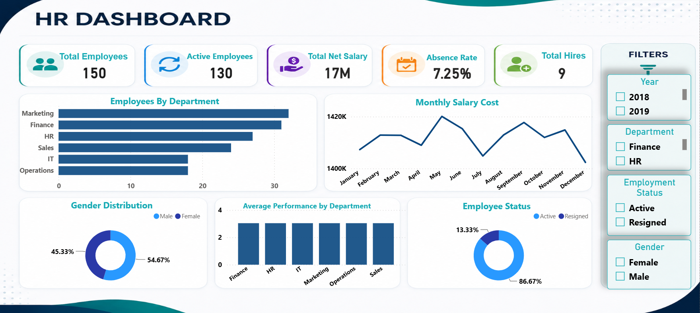

# 📊 HR Analytics Dashboard

An interactive HR analytics dashboard built using Power BI to analyze workforce data and provide actionable insights for human resource decision-making.

## 📌 Project Overview

This project analyzes HR data to monitor employee performance, attendance, salaries, and workforce distribution through an interactive Power BI dashboard.

## 🎯 Objectives

- Clean and transform HR data using Power Query.
- Build an interactive dashboard for HR reporting.
- Analyze employee trends and key HR metrics.
- Support data-driven HR decision-making.

## 🛠️ Tools Used

- Power BI
- Power Query
- DAX
- Data Modeling
- Excel

## 📊 Dashboard Features

- Employee Overview
- Department & Gender Analysis
- Attendance Analysis
- Salary Analysis
- Interactive Filters & Slicers
- Dynamic KPIs and Visualizations

## 📂 Repository Contents

- **HR Analytics Dataset.pbix** – Power BI dashboard.
- **HR Analytics Dataset.xlsx** – Source dataset.
- **Dashboard.png** – Dashboard preview.

## 📸 Dashboard Preview

## 🚀 Skills Demonstrated

- Data Cleaning
- Data Transformation
- Data Modeling
- DAX
- Dashboard Development
- Data Visualization
- HR Analytics
- Business Intelligence

## 👨‍💻 Author

**Peter Gerges Sophy**

- GitHub: https://github.com/petergerges10
- LinkedIn: https://www.linkedin.com/in/peter-gerges-088919388
